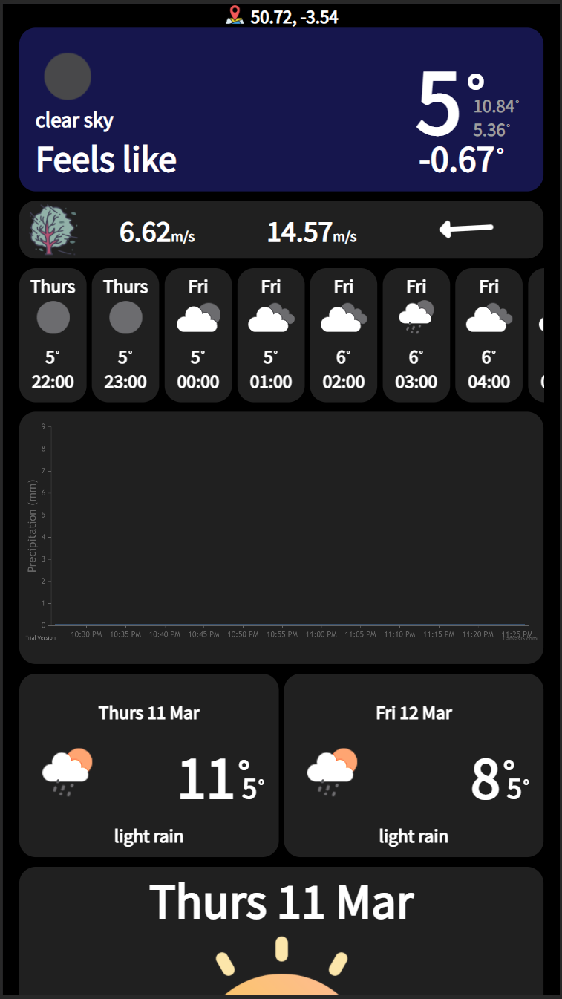

# weather-app
This is a simple progrssive web app that is used to tell the weather at your current location.

All you have to do is go to the ip adress or domain name of the server that is running it and then you can install it on your own device.
---

